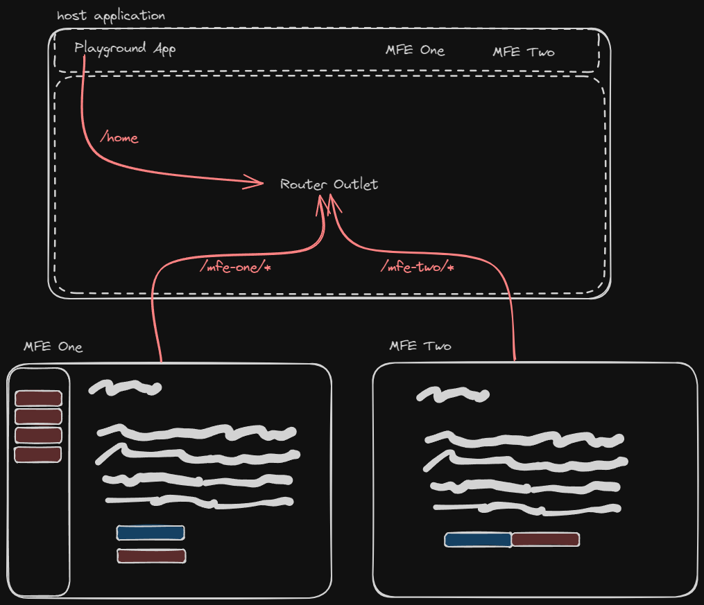

# React Vite Federation (Micro Frontends) Playground

This repo is for experimenting and creating a basic Proof of Concept (PoC) of utilizing Module Federation in a Vite project, with React as the rendering framework.

The project is currently configured as a [Monorepo](https://monorepo.tools/) to accelerate initial development and experimentation, however this will likely be split into a Polyrepo when a full production implementation is created.

## How does it Work?

This application uses [@originjs/vite-plugin-federation](https://github.com/originjs/vite-plugin-federation), [react](https://react.dev/) and [react-router](https://reactrouter.com/en/main) to provide a cohesive micro frontend playground application. This allows the application harness (or `host`) to pull in other applications via their `remoteEntry.js` entrypoints.



Currently, the external applications are loaded via their `routes` configuration, meaning that all applications are retrieved when the router is initialized. See [Roadmap / Stretch Goals](#stretch-goals) for some possible improvements around this.

## How to consume this playground?

This project serves as a bit of a sample application to show a possible configuration of Micro Frontend Applications in React using Vite. There are additional example applications available on the [vite-plugin-federation](https://github.com/originjs/vite-plugin-federation#example-projects) docs for reference.

If you would just like to run the playground to experiment, feel free to fork this repository and run the [Getting Started](#getting-started) guide. Otherwise a detailed guide is provided on how to [Scaffold Applications](#scaffolding-applications), and another on [Findings and Concerns](#findings-and-concerns). Please see the below contents for more.

- [Getting Started](#getting-started)
  - [Debugging](#debugging)
  - [Starting Manually](#starting-manually)
  - [Customizing Ports and URLs](#customizing-ports-and-urls)
- [Scaffolding Applications](#scaffolding-applications)
  - [Configuring Module Federation](#configuring-module-federation)
  - [Configuring React Router](#configuring-react-router)
  - [Configuring Tailwind](#configuring-tailwind)
- [Findings and Concerns](#findings-and-concerns)
  - [Typescript and Type Safety](#typescript-and-type-safety)
  - [Dev Mode and Development Experience](#dev-mode-and-development-experience)
  - [Styling](#styling)
  - [Routing and Lazy Evaluation](#routing-and-lazy-evaluation)
  - [Server-Side Rendering (SSR) and Edge-side Rendering (ESR)](#server-side-rendering-ssr-and-edge-side-rendering-esr)
- [Roadmap](#roadmap)
  - [Stretch Goals](#stretch-goals)

## Getting Started

1. Install dependencies, by running `npm install` in the root folder.
1. Start the applications by opening the project in [VSCode](https://code.visualstudio.com/) and using the `Watch All MFE Applications` debug configuration.
    - Alternatively, the applications can be started manually by following the steps in [Starting Manaully](#starting-manually) below.
1. Open the Host Application on <http://localhost:5400> (default port)
    - The Micro Frontend applications can be accessed directly on <http://localhost:5401> for `mfe-one` and <http://localhost:5402> for `mfe-two`

> **Note**: Currently the Vite Plugin for Module Federation does not support live reloading via `vite dev` on client (MFE) applications, only on the host. Due to this the MFE Applications run with `vite build --watch` and `vite preview` commands, meaning that changes are only loaded after a browser refresh.

### Debugging

It is possible to debug the applications while they are running locally since the micro frontend applications are built with `sourcemap` enabled (see [host/vite.config.js](./host/vite.config.ts)). In order to debug just follow the below steps:

1. Ensure the applications are running (see [Getting Started](#getting-started) or [Starting Manually](#starting-manually)).
1. In [VSCode](https://code.visualstudio.com/) start the `Edge: Debug Host Application` configuration.
    - This will open an instance of the Edge Browser with a debug session open, attach breakpoints across files in each application and they will execute as expected.

If you would like to see more of how this works, see the [.vscode/launch.json](./.vscode/launch.json) in the root of this repository.

### Starting Manually

Starting the application manually is as simple as starting each of the component applications, which can be done with the following:

- Start the Host application by running `npm run dev` in the `host/` folder.
- Start MFE One by running `npm run build:watch` and `npm run preview` in the `clients/mfe-one/` folder.
- Start MFE Two by running `npm run build:watch` and `npm run preview` in the `clients/mfe-two/` folder.

> **Note**: `npm run build:watch` will start a file watcher and automatically rebuild the application, `npm run preview` will serve the assets. They will need to be run in separate terminals as `npm run build:watch` will continue to watch for changes.

### Customizing Ports and URLs

The default ports for applications for local development are selected to work together, however they can be updated at any time. They are currently driven by the following Environment Variables in each application:

- `SERVER_HOST` - Currently defaulted to `0.0.0.0`.
- `SERVER_PORT` - Currently defaulted for each application:
  - `host` -> `5400`
  - `clients/mfe-one` -> `5401`
  - `clients/mfe-two` -> `5402`

Additionally, the `host` application must be made aware of the client applications new routes, which can be customized with the following environment variables on the `host` application:

- `MFE_ONE_URL` - Currently defaulted to `http://localhost:5401/assets/remoteEntry.js`
- `MFE_TWO_URL` - Currently defaulted to `http://localhost:5402/assets/remoteEntry.js`

These can all be customized with the use of a `.env` file in each directory, an `.env.example` file is provided to copy-paste and customize.

## Scaffolding Applications

Creating a new application is as simple as invoking the [Vite](https://vitejs.dev/guide/#scaffolding-your-first-vite-project) template method with the `react-ts` template:

```sh
npm create vite@latest @react-playground/<app> -- --template react-ts
```

Once the application is added, you can make any initial changes required, but otherwise the application is runnable as a standalone app with `vite dev`. Once the application is scaffolded, you can enable [Module Federation](#configuring-module-federation).

### Configuring Module Federation

This playground uses the `@originjs/vite-plugin-federation` package to handle module federation, which has an extensive [Usage Guide](https://github.com/originjs/vite-plugin-federation#usage) on their docs. It is recommended to look that over, however a TL;DR of the configuration applied in this project is below - assuming we are adding `mfe-two` to our application.

1. Install `@originjs/vite-plugin-federation` with `npm install @originjs/vite-plugin-federation --save-dev`.

2. Update the [clients/mfe-two/vite.config.ts](./clients/mfe-two/vite.config.ts) to enable module federation in the application.

```diff
  return defineConfig({
    ...,
    plugins: [
      react(),
+     federation({
+       name: 'mfe-two',
+       filename: 'remoteEntry.js',
+       exposes: {
+         './routes': './src/routes',
+       },
+       shared: ['react', 'react-dom', 'react-router-dom'],
+     }),
    ],
    ...,
  });
```

3. Update the [host/vite.config.ts](./host/vite.config.ts) to make it aware of your new application, for example if we were adding `mfe-two`.

```diff
  return defineConfig({
    ...
    plugins: [
      react(),
      federation({
        name: 'host-app',
        remotes: {
          'external/mfe-one': MFE_ONE_URL,
+         'external/mfe-two': MFE_TWO_URL,
        },
        shared: ['react', 'react-dom', 'react-router-dom'],
      }),
    ],
    ...
  });
```

> **Note** The `shared` module list which defines any production dependencies that are shared across all applications at runtime, in our case these are [react](https://react.dev/) and [react-router](https://reactrouter.com/en/main). This can be extended to include other shared dependencies as needed (for example [react-hook-form](https://react-hook-form.com/)).

4. It is now possible to import the application via the route configured in the [host/vite.config.ts](./host/vite.config.ts) above, for example:

```tsx
import MfeOneRoutes from 'external/mfe-one/routes';

export const MfeOne = () => (<MfeOneRoutes />)
```

> **Note** Without additional configuration, Typescript will complain that no declaration is provided for `external/mfe-one/routes`, see [Findings and Concerns / Typescript and Type Safety](#typescript-and-type-safety) for how we solved this.

### Configuring React Router

Once the above is all configured, Module Federation is working! You can now import and utilize components from external applications, the next step is configuring this to integrate with [react-router](https://reactrouter.com/en/main) to handle our navigation on the host module.

1. Install `react-router-dom` with `npm install react-router-dom`.

2. Export a list of available routes from your new Micro Frontend application, for example in `mfe-two` we have [clients/mfe-two/src/routes.tsx](./clients/mfe-two/src/routes.tsx). These routes currently implement the [Route Object](https://reactrouter.com/en/main/route/route#type-declaration) from react router.

```tsx
// routes.tsx
export const routes: RouteObject[] = [
  {
    path: '/mfe-two',
    element: <App />,
    children: [
      {
        path: '',
        element: <Buttons />,
      },
    ],
  },
];
```

> **Note** The top level `path` is currently configured by the microapplications, if this conflicts with an existing route on the host then your module will not load.

3. Add router configuration to the Micro Frontend application so that it will behave in the same fashion in `standalone` mode (hitting its port directly), this is done by adding a [clients/mfe-two/src/router.tsx](./clients/mfe-two/src/router.tsx) and adding it to the [clients/mfe-two/src/main.tsx](./clients/mfe-two/src/main.tsx).

```tsx
// main.tsx
ReactDOM.createRoot(document.getElementById('root')!).render(
  <React.StrictMode>
    <div className="mfe1-h-screen mfe1-flex">
      <div className="mfe1-flex mfe1-flex-grow mfe1-overflow-auto">
        <RouterProvider router={router} />
      </div>
    </div>
  </React.StrictMode>
);
```

```tsx
// router.tsx
export const router = createBrowserRouter([
  {
    path: '/',
    element: <Standalone />,
  },
  ...routes,
]);
```

### Configuring Tailwind

Tailwind was selected as the styling engine in order to test how different styles interact across the micro applications. Due to these findings each micro application requires its own `prefix` configured, see the [Findings and Concerns / Styling](#styling) section below for more. Otherwise [Tailwind](https://tailwindcss.com/) and [DaisyUI](https://daisyui.com) are configured by the following.

1. Follow the Getting Started guide on [Tailwind](https://tailwindcss.com/docs/guides/vite) for Vite. This should create a [clients/mfe-two/tailwind.config.js](./clients/mfe-two/tailwind.config.js) and [clients/mfe-two/postcss.config.js](./clients/mfe-two/postcss.config.js).

2. Follow the Installation guide on [DaisyUI](https://daisyui.com/docs/install/) to set up DaisyUI, this allows the use of the DaisyUI CSS Component Library.

3. Configure a prefix to avoid styling conflicts with other applications, how this works is documented on the [tailwind configuration](https://tailwindcss.com/docs/configuration#prefix). Make the following changes to the `tailwind.config.js` file to add `prefix` with an appropriate value for your micro application.

```diff
export default {
+ prefix: 'mfe2-',
  content: ['./index.html', './src/**/*.{js,ts,jsx,tsx}'],
  theme: {
    extend: {},
  },
  ...
};
```

4. Configure any [DaisyUI Themes](https://daisyui.com/docs/themes/), [Typography Settings](https://tailwindcss.com/docs/typography-plugin) or other that you may need for this application.

> **Note** Adding a prefix to `tailwind` is a workaround currently, and means that all styles applied in the application need to include the prefix. Additional details are provided in the [Findings and Concerns / Styling](#styling) section below.

## Findings and Concerns

This section provides an overview of all the findings, workarounds and concerns discovered through this PoC process. It is recommended to look each section over and decide if they impact you before taking inspiration from this setup.

### Typescript and Type Safety

Since the [@originjs/vite-plugin-federation](https://github.com/originjs/vite-plugin-federation) plugin allows us to use native ES Module Imports (`import mfe from 'external/mfe/app`), we start running into some complaints from Typescript. There is a section on their docs talking about [error TS2307: Cannot find module](https://github.com/originjs/vite-plugin-federation#error-ts2307-cannot-find-module). This was addressed in the solution with two simple steps.

1. Prefixing all external applications with the `external/` keyword

```js
export default ({ mode }) => {
  return defineConfig({
    ...,
    plugins: [
      react(),
      federation({
        ...,
        remotes: {
          'external/mfe-one': MFE_ONE_URL,
          'external/mfe-two': MFE_TWO_URL,
        },
      }),
    ],
    ...,
  });
```

```tsx
import MfeOneRoutes from 'external/mfe-one/routes';
```

2. Adding a type declaration to [host/src/@types/external.d.ts](./host/src/@types/external.d.ts) to tell typescript what the expected structure of these modules is when imported. The wildcard in the module path `external/*/routes`, means this type will apply to any import matching that pattern.

```ts
declare module 'external/*/routes' {
  const Routes: import('react-router-dom').RouteObject[];
  export default Routes;
}
```

### Dev Mode and Development Experience

Due to a limitation in the [@originjs/vite-plugin-federation](https://github.com/originjs/vite-plugin-federation) as it relates to running a [Development Server](https://vitejs.dev/guide/cli.html#dev-server) with `vite`. This is documented on the [Module Federation Docs](https://github.com/originjs/vite-plugin-federation#vite-dev-mode), and an open issue is open on [issues/525](https://github.com/originjs/vite-plugin-federation/issues/525) and [issues/281](https://github.com/originjs/vite-plugin-federation/issues/281).

This is worked around in this application as shown in the [Starting Manually](#starting-manually) section above, the `client` applications are build using `vite build --watch`, which creates a file watcher build process to automatically rebuild static assets on change. The assets are then served using `vite preview`.

It is recommended to start the application with the `Watch All MFE Applications` debug configuration in [VSCode](https://code.visualstudio.com/) as it wraps all the complexity up for you, and provides a seamless experience (See [Getting Started](#getting-started) for more).

> **Note** This solution does allow changes to be detected and automatically rebuilt while running as a client application, however [Hot Module Replacement](https://vitejs.dev/guide/features.html#hot-module-replacement) will not work for client apps, meaning a manual refresh is required.

### Styling

One of the larger issues with Module Federation is styling, and what side effects could manifest from loading a micro application with conflicting style sheets to the host or other micro applications. Tailwind is still susceptible to this issue, as the style sheets are generated at build time with no awareness of the other applications. This can cause [Functions and Directives](https://tailwindcss.com/docs/functions-and-directives) to mutate the behaviour of CSS Classes of the same name.

A nice overview of this behaviour and possible solutions is available on a blog post [Using TailwindCSS with Module Federation](https://malcolmkee.com/blog/using-tailwindcss-with-module-federation/) by Malcolm Kee.

Based on this we have boiled down two viable solutions, one "cheap and cheerful" with a negative impact on Developer Experience is to add a [Tailwind Prefix](#tailwind-prefix) to each application. The second is to create a [Postcss Build-time Prefixer](#postcss-build-time-prefixer).

Within this playground application we have opted for the [tailwind prefix](https://tailwindcss.com/docs/configuration#prefix) to keep things simple, however I would recommend a more robust solution with a better developer experience for a full production implementation.

#### Tailwind Prefix

This option uses a [tailwind prefix](https://tailwindcss.com/docs/configuration#prefix) that is unique in each application, which enforces that our CSS Class Names are always unique. The implication of this is that the developer must always be aware of the prefix when using tailwind.

For example in the `host` application, the [host/tailwind.config.js](./host/tailwind.config.js) specifies the `prefix` as `host-`. This means I will need to prefix **any** styles with `host-` before they will be picked up and applied.

If I wanted to use the [Grid System of Columns](https://tailwindcss.com/docs/grid-template-columns), in normal tailwind I would just use `className="grid grid-cols-4"` for a grid of 4 columns. However, due to the prefix, this would instead become `className="host-grid host-grid-cols-4"`. This creates a negative development experience as the developer will need to keep this in mind across all applied styles, including for plugins like [daisy UI](https://daisyui.com).

Luckily the [Tailwind CSS IntelliSense](https://marketplace.visualstudio.com/items?itemName=bradlc.vscode-tailwindcss) extension for VSCode is aware of the prefix, and will provide intellisense to validate.

#### Postcss Build-time Prefixer

Part of the [Using TailwindCSS with Module Federation](https://malcolmkee.com/blog/using-tailwindcss-with-module-federation/) blog post, he highlighted [a new solution](https://malcolmkee.com/blog/using-tailwindcss-with-module-federation/#a-new-solution) to improve the developer experience around this.

That is using a postcss plugin like [postcss-prefixer](https://www.npmjs.com/package/postcss-prefixer) to inject prefixes to all styles at build time, and equivalently add a wrapper method to your `className` definitions in code to inject the same prefix.

```js
// tailwind-prefixer.ts
const prefix = 'mfe1-';
export const tw = (...classes) =>
  classes
    .map((cls) =>
      cls
        .split(' ')
        .map((className) => `${prefix}-${className}`)
        .join(' ')
    )
    .join(' ');
```

```jsx
// some-usage.jsx
import tw from 'tailwind-prefixer.ts'
const someUsage = () => (
  <div className={tw('sm:hidden md:block')}>
    <span></span>
  </div>
);
```

### Routing and Lazy Evaluation

### Server-Side Rendering (SSR) and Edge-Side Rendering (ESR)

### Browser Compatibility

Due to the nature of the [@originjs/vite-plugin-federation](https://github.com/originjs/vite-plugin-federation) plugin, it requires the use of [top-level await](https://developer.mozilla.org/en-US/docs/Web/JavaScript/Reference/Operators/await). This can limit browser compatibility, which for this application is currently set to `esnext` (see [host/vite.config.ts](./host/vite.config.ts)).

Some workarounds are available for this if additional compatibility is required, such as setting the build targets to the minimum browsers supporting top level await:

```ts
 build: {
    target: ["chrome89", "edge89", "firefox89", "safari15"]
 }
```

Alternatively, you can look at bringing in the [vite-plugin-top-level-await](https://github.com/Menci/vite-plugin-top-level-await) to polyfill the required function for larger compatibility.

For more information see the documentation on [vite-plugin-federation / ERROR: Top-level await is not available in the configured target environment](https://github.com/originjs/vite-plugin-federation#error-top-level-await-is-not-available-in-the-configured-target-environment).

## Tools Overview

## Roadmap

- [x] Configure and integrate sample host application and multiple micro-applications.
- [x] Configure best practices development tooling (VSCode, ESLint, Prettier, Markdownlint, Editor Config).
- [x] Set up Client Side Routing using [react-router](https://reactrouter.com/en/main).
  - [x] Allow routes to be configured by client Micro Frontend Applications (MFE).
  - [x] Add deeply nested routes from Micro Applications that can be navigated by host (see `mfe-one`).
- [x] Set up CSS Framework to experiment with styling interactions and side effects (using [tailwindcss](https://tailwindcss.com/) and [DaisyUI](https://daisyui.com)).
- [x] Enable Debug configuration for UI Applications with VSCode (one-click development experience).
  - [x] Enable source maps while working locally to enable client side debugging across all apps.
  - [x] Enable file watching across all Micro Applications for easier development experience.
- [x] Set up inter-application communication via a simple event bus (using [browser document API](https://developer.mozilla.org/en-US/docs/Web/API/Document) and [event listeners](https://developer.mozilla.org/en-US/docs/Web/API/EventTarget)).
- [ ] Docker Container for micro frontend applications and `docker-compose` configuration to allow easy development of Micro Applications in isolated repositories

### Stretch Goals

- [ ] Set up dynamic routing support - loading Micro Applications from API Endpoint registry and lazy initialization of micro frontend applications.
- [ ] Create plugin based interface for registering applications ([A Plugin-Based Frontend using Module Federation](https://malcolmkee.com/blog/a-plugin-based-frontend-with-module-federation/))
- [ ] Set up SSR or Edge SSR for initial page load and router initialization support
- [ ] Add monorepo import restrictions and boundaries ([eslint-plugin-import](https://www.npmjs.com/package/eslint-plugin-import) and [eslint-plugin-boundaries](https://www.npmjs.com/package/eslint-plugin-boundaries))
- [ ] Enable [eslint-plugin-tailwindcss](https://www.npmjs.com/package/eslint-plugin-tailwindcss) and [prettier-plugin-tailwindcss](https://www.npmjs.com/package/prettier-plugin-tailwindcss) for stronger CI Validation
